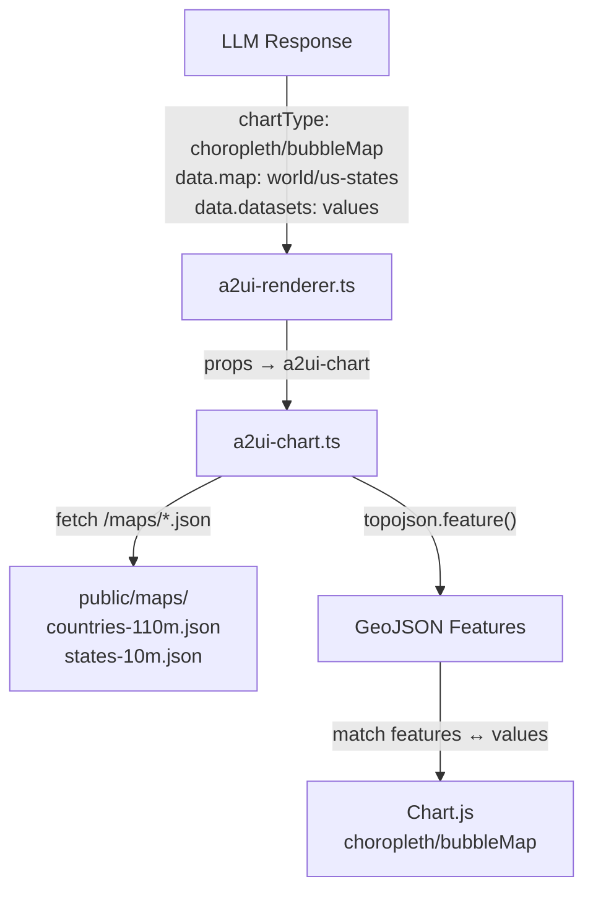

# Geographic Map Charts -- chartjs-chart-geo Integration

## Overview

Add two geographic chart types (**choropleth** and **bubbleMap**) to the A2UI chart component using the `chartjs-chart-geo` Chart.js plugin. Maps render within the existing `<a2ui-chart>` web component. The LLM provides data values; geographic geometry (TopoJSON) is loaded from same-origin static files.

## Architecture




## Dependencies

Install in the `apps/a2ui-chat` workspace:

- `chartjs-chart-geo` ^4.3.6 -- Chart.js plugin providing `ChoroplethController`, `BubbleMapController`, `GeoFeature`, `ColorScale`, `ProjectionScale`, `SizeScale`
- `topojson-client` ^3.1.0 -- converts TopoJSON topology to GeoJSON features at runtime
- `@types/topojson-client` ^3.1.5 (devDep) -- TypeScript types
- `@types/topojson-specification` ^1.0.5 (devDep) -- Topology type

Reference: [apps/a2ui-chat/package.json](apps/a2ui-chat/package.json)

**Important**: `chartjs-chart-geo` does NOT bundle geographic data files. You must supply your own TopoJSON/GeoJSON.

## Static Map Data (Same-Origin)

Place pre-downloaded TopoJSON files in [apps/a2ui-chat/public/maps/](apps/a2ui-chat/public/maps/):

- `countries-110m.json` (~105KB) -- world countries at 1:110M resolution, from `world-atlas@2`
- `states-10m.json` (~112KB) -- US states at 1:10M resolution, from `us-atlas@3`

Source URLs (for download only, not runtime):

- `https://cdn.jsdelivr.net/npm/world-atlas@2/countries-110m.json`
- `https://cdn.jsdelivr.net/npm/us-atlas@3/states-10m.json`

**Why same-origin instead of CDN**: Avoids Content Security Policy (CSP) `connect-src` violations. The app's CSP blocks outbound fetches to `cdn.jsdelivr.net`. Serving from `public/maps/` keeps everything on the same origin, works offline, and is browser-cacheable.

## Frontend Changes

### 1. Chart Component -- [a2ui-chart.ts](apps/a2ui-chat/src/components/a2ui/a2ui-chart.ts)

**Imports and Registration** (top of file):

```typescript
import {
  ChoroplethController,
  BubbleMapController,
  GeoFeature,
  ColorScale,
  ProjectionScale,
  SizeScale,
} from 'chartjs-chart-geo';
import * as topojson from 'topojson-client';
import type { Topology } from 'topojson-specification';

Chart.register(
  // ...existing registrations...
  ChoroplethController, BubbleMapController, GeoFeature,
  ColorScale, ProjectionScale, SizeScale,
);
```

**Data interface extension** -- add `map` field to `ChartData`:

```typescript
interface ChartData {
  labels?: string[];
  datasets: ChartDataset[];
  map?: string;  // "world" | "us-states"
}
```

**Chart type union** -- extend `chartType` property:

```typescript
@property({ type: String }) chartType: '...' | 'choropleth' | 'bubbleMap' = 'bar';
```

**Static map config and cache** (class-level):

```typescript
private static _mapCache = new Map<string, { features: GeoJSON.Feature[]; outline: GeoJSON.Feature }>();

private static MAP_SOURCES: Record<string, { url: string; featureKey: string; outlineKey: string }> = {
  world: {
    url: '/maps/countries-110m.json',
    featureKey: 'countries',
    outlineKey: 'land',
  },
  'us-states': {
    url: '/maps/states-10m.json',
    featureKey: 'states',
    outlineKey: 'nation',
  },
};
```

**Async map loading** -- `loadMapData(mapKey)`:

- Checks static `_mapCache` first (in-memory, persists across component instances)
- Fetches TopoJSON from `/maps/*.json`
- Converts via `topojson.feature(topo, topo.objects[key])` to GeoJSON FeatureCollection
- Caches and returns `{ features, outline }`

**Geo chart rendering** -- `renderGeoChart()`:

- Sets `_geoLoading = true` while fetching (shows spinner in template)
- For **choropleth**: builds `valueMap` from LLM data (`{feature, value}` pairs), matches to geographic features by name (case-insensitive), creates Chart.js config with `projection` and `color` scales
- For **bubbleMap**: maps LLM data (`{latitude, longitude, value, description}`) directly, creates config with `projection` and `size` scales
- Projection selection: `albersUsa` for `us-states`, `equalEarth` for `world`

**Rendering entry point** -- `renderChart()`:

- Early return for geo types: `if (chartType === 'choropleth' || chartType === 'bubbleMap') { renderGeoChart(); return; }`
- Existing chart logic unchanged

**Loading UX** -- template shows a spinner overlay while TopoJSON loads:

```html
${this._geoLoading ? html`
  <div class="geo-loading" style="height: ${height}px">
    <div class="spinner"></div>
    <span>Loading map...</span>
  </div>
` : ''}
<canvas style="${this._geoLoading ? 'display:none' : ''}"></canvas>
```

### 2. Renderer -- [a2ui-renderer.ts](apps/a2ui-chat/src/services/a2ui-renderer.ts)

No changes needed. The existing `case 'chart'` block passes `chartType`, `data`, and `options` through to `<a2ui-chart>` generically.

## Backend Changes

### 3. Micro-contexts -- [micro_contexts.py](a2ui-agent/micro_contexts.py)

Register two new micro-context fragments that get injected into the system prompt when geo charts are detected:

- `chart_choropleth` -- strict data format: `{ map: "world"|"us-states", datasets: [{ label, data: [{ feature: "Name", value: number }] }] }`
- `chart_bubblemap` -- strict data format: `{ map: "world"|"us-states", datasets: [{ label, data: [{ latitude, longitude, value, description }] }] }`

Key rules in each micro-context:

- ONE dataset only
- Feature names must match the map exactly (country names for world, full state names for US)
- `height: 350+` recommended
- Do NOT include `labels[]` -- derived from the map

### 4. Chart type hint mapping -- [llm_providers.py](a2ui-agent/llm_providers.py)

`**_CHART_TYPE_TO_HINT**` dict -- add mappings from data-source `chart_type` values to micro-context keys:

```python
"choropleth": "chart_choropleth",
"geo": "chart_choropleth",
"geographic": "chart_choropleth",
"bubblemap": "chart_bubblemap",
"bubble_map": "chart_bubblemap",
```

`**_EXOTIC_CHART_PATTERNS**` dict -- add regex patterns for query-text detection (no data sources):

```python
"chart_choropleth": re.compile(
    r"\b(?:choropleth|geo(?:graphic)?\s*map|country\s*map|state\s*map|world\s*map|us\s*map)\b",
    re.IGNORECASE,
),
"chart_bubblemap": re.compile(
    r"\b(?:bubble\s*map|geo(?:graphic)?\s*bubble|location\s*map|city\s*map|lat(?:itude)?\s*long(?:itude)?)\b",
    re.IGNORECASE,
),
```

### 5. Base rules / component catalog -- [_base.py](a2ui-agent/content_styles/_base.py)

Add `choropleth|bubbleMap` to the chart `chartType` enum and inline data format docs:

```
Choropleth: {map:"world"|"us-states",datasets:[{label,data:[{feature:"Name",value:number},...]}]}. Geographic heat map.
BubbleMap: {map:"world"|"us-states",datasets:[{label,data:[{latitude,longitude,value,description},...]}]}. Geographic bubble map.
```

## Data Flow: LLM to Rendered Map

1. User asks "show US population by state on a map"
2. **Analyzer** detects geo intent via `_EXOTIC_CHART_PATTERNS["chart_choropleth"]`
3. **Micro-context** `chart_choropleth` injected into system prompt with strict data format
4. **LLM** returns A2UI JSON with `chartType: "choropleth"`, `data.map: "us-states"`, and `data.datasets[0].data: [{feature: "California", value: 39538223}, ...]`
5. **a2ui-renderer** passes props to `<a2ui-chart>`
6. **a2ui-chart** detects geo type, calls `renderGeoChart()`
7. `loadMapData("us-states")` fetches `/maps/states-10m.json`, converts to GeoJSON via topojson-client, caches result
8. Feature names from LLM matched to GeoJSON features (case-insensitive)
9. Chart.js renders the choropleth with `projection: "albersUsa"` and a 5-quantize color scale

## Supported Maps and Projections

- `**"world"`** -- `countries-110m.json`, objects: `countries` (features) + `land` (outline), projection: `equalEarth`
- `**"us-states"`** -- `states-10m.json`, objects: `states` (features) + `nation` (outline), projection: `albersUsa`

## Key Design Decisions

- **Same-origin map data** over CDN fetches (CSP compliance, offline support)
- **Async rendering** with loading spinner (maps require a network fetch on first use, ~100ms from local, cached thereafter)
- **Static in-memory cache** on the component class -- TopoJSON parsed once, reused across all chart instances
- **Case-insensitive feature matching** -- tolerates LLM variations like "United states" vs "United States"
- **Coordinate field aliases** -- bubbleMap accepts `latitude/lat`, `longitude/lng/lon` for robustness against LLM variations

