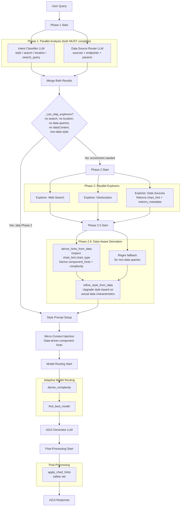
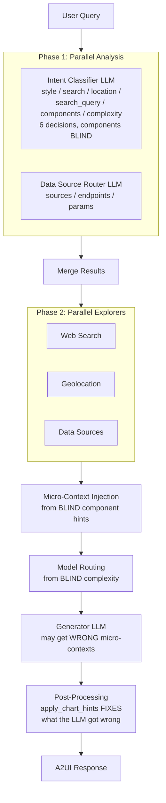
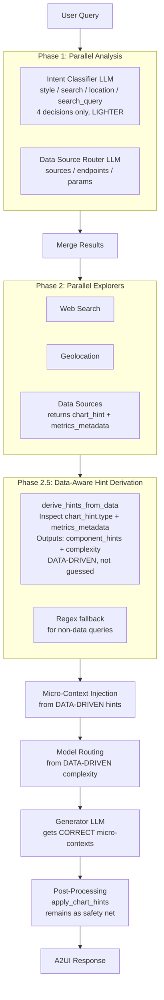

# A2UI Agent Pipeline Workflow

> Complete documentation of the backend pipeline architecture: Phase 1 (Intent Classifier + Data Source Router), Phase 2 (Parallel Explorers), Phase 2.5 (Data-Aware Derivation), Model Routing, and Post-Processing.
>
> **Key improvements:** Removed blind component/complexity guessing from the Intent Classifier. Component hints and complexity are now derived deterministically from actual data source responses.
> **Phase 1 always completes fully** — both Classifier and Router run to completion before any skip decisions.
> **Phase 2 skip** — when both agents agree no enrichment is needed, Phase 2 (explorers) is skipped entirely.
> **Post-data style refinement** — content style is re-evaluated after data returns based on actual data characteristics.

---

## Final Pipeline Architecture



---

## Pipeline Paths by Query Type

Phase 1 always runs both agents to completion. The skip decision happens AFTER Phase 1:

```
"Hello"                         "Show me claims by state"          "Show me claims from genie"
    │                                   │                                   │
    ▼                                   ▼                                   ▼
Phase 1: Classifier + Router    Phase 1: Classifier + Router       Phase 1: Classifier + Router
(both complete, ~3s parallel)   (both complete, ~3s parallel)      (both complete, ~3s parallel)
    │                                   │                                   │
    ▼                                   ▼                                   ▼
Classifier: quick, no tools     Classifier: analytical, no search  Classifier: analytical, no search
Router: no data sources         Router: claims-insights            Router: genie endpoint
    │                                   │                                   │
    ▼                                   ▼                                   ▼
_can_skip_explorers → YES       _can_skip_explorers → NO           _can_skip_explorers → NO
Skip Phase 2 + 2.5             Phase 2: Data Sources (~5s)        Phase 2: Genie (~40-50s)
    │                                   │                                   │
    ▼                                   ▼                                   ▼
LLM Generate (2-3s)             Phase 2.5: Hints + Style Refine   Phase 2.5: Hints + Style Refine
    │                                   │                                   │
    ▼                                   ▼                                   ▼
Response (~5-6s total)          LLM Generate (10-15s)              LLM Generate (10-15s)
                                        │                                   │
                                        ▼                                   ▼
                                Response (~20-25s total)            Response (~55-70s total)
```

### "Hello" on an Alert Detail Page

When `dataContext` is pre-injected by the frontend (alert title, severity, claims):

```
Phase 1:  Classifier + Router (both complete, ~3s parallel)
          Classifier: alert-detail (forced by frontend), no search, no location
          Router: no additional sources (data already in dataContext)
          _can_skip_explorers → NO (has_data_context=True, data-oriented style)
Phase 2:  Skipped (no active queries), passive dataContext injected
Phase 2.5: Hints derived from passive data
LLM:      Generator sees alert_detail prompt + dataContext
          "Hello! I see you're looking at the 'High-Value Claims Pending' alert..."
──────────────────────────────────────────────────
Total: ~5-6s
```

### Future: Content Style as Recipe

When `alert_detail.py` evolves to declare its own routing:

```python
# Future alert_detail.py
STYLE = {
    "id": "alert-detail",
    ...
    "routing": [                           # ← new: built-in routing
        {"source": "claims-insights", "endpoint": "/api/v1/alerts/{alert_id}"},
    ],
    "extract_params": {                    # ← new: URL param extraction
        "alert_id": {"from": "url", "decrypt": True},
    },
}
```

This makes the Router LLM return empty (the style already provides routing), and
the pipeline uses the style's own routing to fetch data — no LLM call wasted on
a known page layout. The Classifier's job also shrinks (style is forced by the
frontend), approaching the strict-shape fast path.

---

## Problem

The Intent Classifier LLM (Phase 1) was making **6 decisions** in one call: `style`, `search`, `location`, `search_query`, `components`, `complexity`. Two of these — `components` and `complexity` — were **guessed blind** from the query text alone, before any data had been fetched.

This was a fundamental design flaw:

1. The classifier picked component types (e.g., `chart_matrix`, `chart_sankey`) without seeing the data shape, column types, or row count.
2. Meanwhile, the Databricks API returns rich `chart_hint` metadata (e.g., `chart_type: "stacked_bar_with_line"`, axis definitions, format hints) and `metrics_metadata` — expert-level visualization guidance authored by data analysts who know the data intimately.
3. The classifier's blind guesses were often **wrong or redundant** — and got overridden anyway by `_apply_chart_hints` in post-processing.

The data analyst metadata — which is genuinely state-of-the-art for component selection — was only used as a **post-hoc correction** instead of driving the pipeline from the start.

---

## Solution

Remove `components` and `complexity` from the classifier entirely. Replace them with a **deterministic, zero-cost function** (`_derive_hints_from_data`) that runs after data source responses arrive (Phase 2.5), using the actual `chart_hint` and `metrics_metadata` from API responses.

No extra LLM call. No added latency. More accurate results.

---

## Architecture: Before vs. After

### Before (Blind Guessing)



### After (Data-Driven)



---

## Data Flow: Before vs. After

### Before: Wasted Work

```
Phase 1:    Classifier guesses components=["chart_matrix"]     ← BLIND, no data
Phase 2:    Data API returns chart_hint={type:"stacked_bar_with_line"}  ← TRUTH
Phase 3:    Generator gets micro-context for chart_matrix      ← WRONG instructions
Phase 4:    _apply_chart_hints replaces LLM chart with bar+line ← CORRECT but wasteful
```

### After: Data-Driven Pipeline

```
Phase 1:    Classifier decides style/search/location/query     ← focused, fast
Phase 2:    Data API returns chart_hint={type:"stacked_bar_with_line"}  ← TRUTH
Phase 2.5:  _derive_hints_from_data maps to component hints    ← DATA-DRIVEN, 0ms
Phase 3:    Generator gets correct micro-context + correct model ← ACCURATE
Phase 4:    _apply_chart_hints still runs as safety net         ← unchanged
```

---

## What Changed

All changes in [`apps/a2ui-agent/src/llm_providers.py`](../../apps/a2ui-agent/src/llm_providers.py). No frontend changes. No data source changes.

### 1. Slimmed the Intent Classifier

Removed from the classifier:

| Removed                     | What it was                                                                                |
| --------------------------- | ------------------------------------------------------------------------------------------ |
| `components` field          | Array of component hint keys (e.g., `["chart_matrix"]`) — guessed from query text          |
| `complexity` field          | Task complexity level (`standard`/`moderate`/`high`/`reasoning`) — guessed from query text |
| Component hints catalog     | ~7 lines of component descriptions in the prompt template                                  |
| Complexity tier definitions | ~4 lines of complexity level descriptions in the prompt template                           |

**Affected functions:**

- `_make_classifier_system()` — removed decisions 5 and 6 from the system prompt
- `_CLASSIFIER_PROMPT_TEMPLATE` — removed component hints catalog and complexity tiers (~40% smaller)
- `_classify_intent()` — no longer parses `components` or `complexity` from JSON response

**Classifier output reduced from 6 fields to 4:**

```json
// Before
{"style":"analytical","search":true,"location":false,"search_query":"...","components":["chart_matrix"],"complexity":"high"}

// After
{"style":"analytical","search":true,"location":false,"search_query":"..."}
```

### 2. Added `_derive_hints_from_data()` Function

New deterministic function that derives component hints and complexity from actual data source responses. Zero LLM calls, ~0ms execution time.

**New constants:**

- `_CHART_TYPE_TO_HINT` — maps `chart_hint.chart_type` values to micro-context keys
- `_EXOTIC_CHART_PATTERNS` — compiled regex patterns for non-data query fallback

**Chart type mapping:**

| `chart_hint.chart_type`  | Micro-context key | Needs exotic instructions?           |
| ------------------------ | ----------------- | ------------------------------------ |
| `stacked_bar_with_line`  | `None`            | No — standard bar+line               |
| `bar_with_line`          | `None`            | No — standard bar+line               |
| `bar`                    | `None`            | No — standard bar                    |
| `stacked_bar`            | `None`            | No — standard stacked bar            |
| `line`                   | `None`            | No — standard line                   |
| `multi_line`             | `None`            | No — standard multi-line             |
| `donut`                  | `None`            | No — standard pie/doughnut           |
| `table`                  | `None`            | No — data-table component            |
| `horizontal_grouped_bar` | `None`            | No — standard bar (horizontal)       |
| `matrix` / `heatmap`     | `chart_matrix`    | Yes — exotic `{x, y, v}` format      |
| `treemap`                | `chart_treemap`   | Yes — tree array format              |
| `sankey`                 | `chart_sankey`    | Yes — flow `{from, to, flow}` format |
| `funnel`                 | `chart_funnel`    | Yes — descending values format       |
| `radar`                  | `chart_radar`     | Yes — multi-axis format              |
| `scatter` / `bubble`     | `chart_scatter`   | Yes — `{x, y}` point format          |

**Complexity derivation from data characteristics:**

| Condition                                | Derived complexity |
| ---------------------------------------- | ------------------ |
| Exotic component hints present           | `high`             |
| Dual-axis chart or >2 stacked bar series | `moderate`         |
| >50 data rows                            | `moderate`         |
| None of the above                        | `standard`         |

**Non-data query fallback:**

When `ds_results` is empty (general/web-search queries), regex patterns detect exotic chart keywords in the query text:

| Pattern         | Matches                                               |
| --------------- | ----------------------------------------------------- |
| `chart_matrix`  | "heatmap", "heat map", "matrix", "correlation matrix" |
| `chart_treemap` | "treemap", "tree map"                                 |
| `chart_sankey`  | "sankey", "flow diagram", "alluvial"                  |
| `chart_funnel`  | "funnel", "conversion funnel", "sales pipeline"       |
| `chart_radar`   | "radar", "spider chart", "star chart"                 |
| `chart_scatter` | "scatter", "bubble chart", "correlation plot"         |

### 3. Rewired `generate_stream` Pipeline

Inserted Phase 2.5 between data source results processing and micro-context injection:

```python
# ── Phase 2.5: Data-Aware Hint Derivation (deterministic, 0ms) ──
ai_component_hints, ai_complexity = _derive_hints_from_data(
    ds_active_results, message,
)
```

**Pipeline insertion point:** After `ds_context` assembly, before Step 3b (style prompt setup).

**SSE event:** A new `data_hints` step event is emitted when hints or non-standard complexity are derived, giving the frontend visibility into the data-driven decision.

**Variables `ai_component_hints` and `ai_complexity`** are now:

- Declared with default values at pipeline start (empty list, `"standard"`)
- Populated by `_derive_hints_from_data()` in Phase 2.5
- Consumed unchanged by micro-context injection (Step 3c) and model routing (Step 3d)

### 4. Phase 2 Skip: `_can_skip_explorers()` (post Phase 1)

Phase 1 always runs both Classifier + Router in parallel via `asyncio.gather` — **neither is ever cancelled early**. The Router must complete because:

1. It provides essential data source routing context
2. Content styles will evolve to declare their own routing (the Router returning empty is itself a signal)
3. For data-oriented pages, the Router identifies what to fetch even when `dataContext` is already present

**After both complete**, `_can_skip_explorers()` decides if Phase 2 (explorers) is needed:

```python
def _can_skip_explorers(classification, routing, content_style, has_data_context):
    """Skip Phase 2 only when ALL conditions are true:
    - Classifier: search=False, location=False
    - Router: returned no data source queries
    - No passive dataContext from frontend
    - Style is not data-oriented
    """
```

**When skippable:** Phase 2 (web search, geolocation, data source fetching) and Phase 2.5 (hints, style refinement) are bypassed — the pipeline jumps from Phase 1 merge directly to style prompt setup → LLM generator.

**SSE event:** A `phase2_skip` step event is emitted: `"Phase 2 skipped — no enrichment needed"`.

### 5. Post-Data Style Refinement: `_refine_style_from_data()`

After data sources return in Phase 2.5, the content style is re-evaluated based on what the data actually looks like. This catches cases where Phase 1 picked a generic style but the data warrants a richer layout.

**Only applies when `content_style == "auto"`** — explicit styles from the frontend are never changed.

**Decision matrix:**

| Data characteristic                        | Style refinement        |
| ------------------------------------------ | ----------------------- |
| `chart_hint` or `metrics_metadata` present | Upgrade to `analytical` |
| >20 records returned                       | Upgrade to `analytical` |
| Data returned but style was `quick`        | Upgrade to `content`    |
| Already `analytical` or `dashboard`        | No change               |
| No data returned                           | No change               |

**SSE event:** When the style changes, a `style_refine` step event is emitted: `"Style refined: content → analytical"`.

---

## Impact Summary

| Aspect                  | Before                           | After                                                               |
| ----------------------- | -------------------------------- | ------------------------------------------------------------------- |
| Classifier output       | 6 fields                         | 4 fields                                                            |
| Classifier prompt size  | ~1.2 KB                          | ~0.7 KB (40% smaller)                                               |
| Component decisions     | Blind guess from query text      | Data-driven from `chart_hint` + data shape                          |
| Complexity derivation   | Blind guess from query text      | Derived from actual data characteristics                            |
| Micro-context accuracy  | Often wrong                      | Correct (informed by API metadata)                                  |
| Model routing accuracy  | Based on guessed complexity      | Based on real data complexity                                       |
| Extra LLM calls         | 0                                | 0 (deterministic function, ~0ms)                                    |
| Non-data query handling | LLM-based guessing               | Regex fallback (instant, zero cost)                                 |
| `_apply_chart_hints`    | Frequently corrects LLM output   | Remains as safety net, corrects less often                          |
| Phase 1 strategy        | `asyncio.gather` (wait for both) | `asyncio.gather` — both always complete, then `_can_skip_explorers` |
| Content style timing    | Locked in Phase 1 (blind)        | Refined in Phase 2.5b after seeing actual data                      |
| "Hello" response time   | ~6-8s (Phase 2 overhead)         | ~5-6s (Phase 2 skipped when both agents agree)                      |

### Latency by Query Type

| Query type                                     | Before  | After      | Delta                                            |
| ---------------------------------------------- | ------- | ---------- | ------------------------------------------------ |
| **"Hello" (trivial)**                          | ~6-8s   | **~5-6s**  | **-1-2s** (Phase 2 skipped)                      |
| **"Hello" on alert-detail** (with dataContext) | ~6-8s   | ~5-6s      | ~0s (Phase 2 still runs for data-oriented style) |
| **Data query (claims)**                        | ~20-60s | ~20-60s    | ~0s (full pipeline justified)                    |
| **General knowledge**                          | ~8-12s  | **~7-10s** | **-1s** (Phase 2 skipped)                        |

### Phase-by-Phase Latency

| Phase                      | Before               | After                                    | Delta     |
| -------------------------- | -------------------- | ---------------------------------------- | --------- |
| Intent Classifier          | ~1.2s (6-field JSON) | ~0.9s (4-field JSON, smaller prompt)     | **-0.3s** |
| Router                     | ~2-3s (always runs)  | ~2-3s (always runs, never cancelled)     | 0s        |
| Phase 1 total (parallel)   | ~3s                  | ~3s                                      | 0s        |
| Phase 2 (trivial queries)  | ~0-1s overhead       | 0s (skipped by `_can_skip_explorers`)    | **-0-1s** |
| Data-Aware Hint Derivation | N/A                  | ~0ms (dict inspection)                   | +0ms      |
| Post-Data Style Refinement | N/A                  | ~0ms (dict inspection)                   | +0ms      |
| Generator LLM              | Baseline             | Slightly better (correct micro-contexts) | ~0s       |

---

## Why Not a "Components LLM"?

Adding a third LLM call between data fetch and generation was considered and rejected:

1. **Latency** — Another ~1.5s round-trip to the LLM provider
2. **Cost** — ~$0.003/call additional spend
3. **Unnecessary** — The `chart_hint` metadata from data analysts already contains expert-level visualization decisions. This is deterministic knowledge, not something requiring LLM reasoning.

The data analysts who define `chart_hint: { chart_type: "stacked_bar_with_line", x_axis: {...}, y_axis_left: {...} }` **are** the component selection experts. We wire their metadata directly into the pipeline.

---

## Design: Why Phase 1 Always Completes Fully

Both the Classifier and Router always run to completion — no early cancellation. This was a deliberate choice:

1. **The Router's output is always valuable.** Even returning empty is a signal — it means the Router evaluated all available data sources and found none relevant. This is different from "we never asked."
2. **Content styles are evolving into recipes.** Future `alert_detail.py` will declare its own routing, URL param extraction, and data dependencies. The Router returning empty on those pages validates that the style's built-in routing is sufficient.
3. **No brittle patterns.** A regex pre-classifier or mid-flight cancellation based on partial information would be fragile. Both LLM agents see the full picture (message + history + catalog) before the pipeline decides.
4. **Phase 1 is already parallel.** Both agents run concurrently via `asyncio.gather`, so waiting for both costs `max(classifier, router)` ≈ 3s, not `classifier + router`.
5. **The real savings are in Phase 2.** Web search, geolocation, and data source fetching are the expensive steps (5-50s). Skipping them when Phase 1 unanimously says "nothing needed" is where the time is saved.

The key insight: **front-load intelligence into Phase 1 so Phase 2 can be confidently skipped.**

### Future: Content Style as Orchestrator

The direction is for content styles to become self-sufficient "recipes" that declare:

- What data sources to query (routing)
- What URL parameters to extract (context)
- What components to prioritize (already exists)
- What prompt to use (already exists)

When a style provides its own routing, the Router LLM becomes a validator rather than a discoverer — it confirms "nothing else is needed beyond what the style declared." This progressively reduces the pipeline to: **Style routing → Data fetch → LLM generate** — approaching strict-shape speeds with full data awareness.

---

## Files Changed

| File                                                   | Change                                                                                                                                                                        |
| ------------------------------------------------------ | ----------------------------------------------------------------------------------------------------------------------------------------------------------------------------- |
| `apps/a2ui-agent/src/llm_providers.py`                 | Slim classifier prompt, add `_derive_hints_from_data()`, add `_can_skip_explorers()` (post Phase 1), add `_refine_style_from_data()`, Phase 2 skip logic in `generate_stream` |
| `apps/a2ui-agent/src/micro_contexts.py`                | No changes (existing keys, called at a different time)                                                                                                                        |
| `apps/a2ui-agent/src/data_sources/claims-routing.yaml` | No changes                                                                                                                                                                    |
| Frontend                                               | No changes                                                                                                                                                                    |
| Databricks API                                         | No changes                                                                                                                                                                    |
