# AI Pipeline Workflow Diagram

Complete visual representation of the A2UI AI pipeline from user query to response.

## Complete Pipeline Flow

```mermaid
flowchart TD
    Start([User Query]) --> Step0[Step 0: Tool State Resolution]
    
    Step0 --> |env > user > default| Step1[Step 1: Input Sanitization]
    Step1 --> |injection detection + delimiter stripping| P1Gate[Phase 1: Parallel Analysis Start]
    
    subgraph P1["Phase 1: Parallel Analysis (asyncio.gather)"]
        direction LR
        IC[Intent Classifier LLM<br/>Outputs: style, search, location, search_query<br/>~0.9s]
        DSR[Data Source Router LLM<br/>Outputs: sources, endpoints, params<br/>~2-3s]
    end
    
    P1Gate --> IC
    P1Gate --> DSR
    
    IC --> Merge[Merge Results]
    DSR --> Merge
    
    Merge --> SkipCheck{_can_skip_explorers?<br/>Check: no search, no location,<br/>no data queries, no dataContext,<br/>non-data style}
    
    SkipCheck -->|Yes: Skip Phase 2| StyleSetup[Step 3: Style Prompt Setup]
    SkipCheck -->|No: Enrichment needed| P2Gate[Phase 2: Parallel Explorers Start]
    
    subgraph P2["Phase 2: Parallel Explorers (asyncio.gather)"]
        direction LR
        GEO[Geolocation Explorer<br/>May pause for browser permission<br/>Returns: location_context]
        WS[Web Search Explorer<br/>Tavily API<br/>Returns: search_results + images]
        DS[Data Source Explorer<br/>Queries configured sources<br/>Returns: chart_hint + metrics_metadata]
        DC[Passive DataContext<br/>Pre-fetched from frontend<br/>Returns: data blocks]
    end
    
    P2Gate --> GEO
    P2Gate --> WS
    P2Gate --> DS
    P2Gate --> DC
    
    GEO --> P25Gate[Phase 2.5: Data-Aware Derivation]
    WS --> P25Gate
    DS --> P25Gate
    DC --> P25Gate
    
    subgraph P25["Phase 2.5: Data-Driven Decisions"]
        direction TB
        DHD[_derive_hints_from_data<br/>Inspect chart_hint.chart_type<br/>Derive: component_hints + complexity<br/>~0ms deterministic]
        RF[Regex Fallback<br/>For non-data queries<br/>Detect exotic chart keywords]
        SR[_refine_style_from_data<br/>Upgrade style based on<br/>actual data characteristics<br/>Only if style='auto']
    end
    
    P25Gate --> DHD
    P25Gate --> RF
    DHD --> SR
    RF --> SR
    
    SR --> StyleSetup
    
    subgraph Step3["Step 3: System Prompt Assembly"]
        direction TB
        Base[Base Rules]
        Style[Style-Specific Prompt<br/>from content_styles/]
        Micro[Micro-Context Injection<br/>Data-driven component hints]
        DataRules[Data Source Rules]
    end
    
    StyleSetup --> Base
    Base --> Style
    Style --> Micro
    Micro --> DataRules
    
    DataRules --> MRTGate[Step 3d: Adaptive Model Routing]
    
    subgraph MRT["Adaptive Model Routing"]
        direction LR
        DeriveComp[derive_complexity<br/>From data-driven hints]
        FindModel[find_best_model<br/>Upgrade/downgrade based on complexity]
    end
    
    MRTGate --> DeriveComp
    DeriveComp --> FindModel
    
    FindModel --> Step4[Step 4: LLM Generation]
    
    subgraph Step4Details["Step 4: LLM Generation Details"]
        direction TB
        Stream[Token Streaming<br/>Yields: token events]
        Fallback[Model Fallback<br/>On error, try alternative model]
        Refusal[Refusal Guard<br/>Retry on refusal]
    end
    
    Step4 --> Stream
    Stream --> Fallback
    Fallback --> Refusal
    
    Refusal --> Step5Gate[Step 5: Post-Processing Start]
    
    subgraph Step5["Step 5: Post-Processing"]
        direction TB
        Normalize[_normalize_a2ui_components]
        ChartHints[_apply_chart_hints<br/>Safety net for chart corrections]
        Suggestions[_normalize_suggestions]
        Hierarchy[_enforce_visual_hierarchy]
        Metadata[Add Metadata<br/>_search, _location, _images,<br/>_data_sources]
    end
    
    Step5Gate --> Normalize
    Normalize --> ChartHints
    ChartHints --> Suggestions
    Suggestions --> Hierarchy
    Hierarchy --> Metadata
    
    Metadata --> Response([A2UI Response])
    
    style Start fill:#e1f5ff
    style Response fill:#d4edda
    style P1 fill:#fff3cd
    style P2 fill:#d1ecf1
    style P25 fill:#f8d7da
    style Step3 fill:#e2e3e5
    style MRT fill:#d4edda
    style Step4Details fill:#cfe2ff
    style Step5 fill:#f0d6ff
```



## SSE Events Emitted

The pipeline emits Server-Sent Events (SSE) throughout execution:

| Event Type | When Emitted | Data Included |
|-----------|--------------|---------------|
| `step` | Each pipeline phase | `id`, `status` (start/done), `label`, `detail`, `reasoning` |
| `token` | During LLM generation | `delta` (text chunk) |
| `complete` | Final response ready | Full A2UI response dict |
| `need_location` | Geolocation required | `request_id` |
| `error` | On failure | `message` |

## Pipeline Phases Breakdown

### Step 0: Tool State Resolution
- Resolves tool enablement: `env override > user setting > default`
- Tools: web_search, geolocation, history, ai_classifier, data_sources
- Emits: `step` event with tool states

### Phase 1: Parallel Analysis (~3s)
- **Intent Classifier**: Determines style, search needs, location needs, search query
- **Data Source Router**: Identifies which data sources to query and parameters
- Both run concurrently via `asyncio.gather`
- Fallbacks: Regex for classifier, keyword matching for router

### Phase 1+: Skip Check
- Evaluates if Phase 2 can be skipped
- Conditions: no search, no location, no data queries, no dataContext, non-data style
- Emits: `phase2_skip` event if skipped

### Phase 2: Parallel Explorers (0-50s)
- **Geolocation**: May pause for browser permission, returns location context
- **Web Search**: Tavily API, returns search results + images
- **Data Sources**: Queries configured sources, returns chart_hint + metrics_metadata
- **Passive DataContext**: Pre-fetched data from frontend
- All run concurrently via `asyncio.gather`

### Phase 2.5: Data-Aware Derivation (~0ms)
- **derive_hints_from_data**: Inspects chart_hint.chart_type, derives component_hints + complexity
- **Regex fallback**: For non-data queries, detects exotic chart keywords
- **refine_style_from_data**: Upgrades style based on actual data (only if style='auto')
- Emits: `data_hints` and `style_refine` events when applicable

### Step 3: System Prompt Assembly
- Base rules (core A2UI protocol)
- Style-specific prompt (from content_styles/)
- Micro-context injection (data-driven component hints)
- Data source rules

### Step 3d: Adaptive Model Routing
- Derives complexity from data-driven hints
- Finds best model (upgrade/downgrade based on complexity)
- Routes to appropriate LLM model

### Step 4: LLM Generation (2-15s)
- Token streaming: Yields progressive text chunks
- Model fallback: On error, tries alternative model
- Refusal guard: Retries on refusal responses
- Emits: `token` events during streaming

### Step 5: Post-Processing
- Normalize A2UI components
- Apply chart hints (safety net)
- Normalize suggestions
- Enforce visual hierarchy
- Add metadata (_search, _location, _images, _data_sources)
- Emits: `complete` event with full response

## Query Type Examples

### Simple Query: "Hello"
```
Phase 1: Classifier + Router (~3s parallel)
  → Classifier: quick, no search, no location
  → Router: no data sources
  → Skip Phase 2 ✓
  → LLM Generate (~2-3s)
Total: ~5-6s
```

### Data Query: "Show me claims by state"
```
Phase 1: Classifier + Router (~3s parallel)
  → Classifier: analytical, no search
  → Router: claims-insights endpoint
Phase 2: Data Sources (~5s)
Phase 2.5: Derive hints from chart_hint
  → component_hints: [chart_matrix]
  → complexity: high
Step 3d: Route to high-complexity model
Step 4: LLM Generate (~10-15s)
Total: ~20-25s
```

### Alert Detail Page (with dataContext)
```
Phase 1: Classifier + Router (~3s parallel)
  → Classifier: alert-detail (forced), no search
  → Router: no additional sources (data already present)
Phase 2: Skipped (passive dataContext injected)
Phase 2.5: Hints derived from passive data
Step 4: LLM Generate (~2-3s)
Total: ~5-6s
```

## Key Design Decisions

1. **Phase 1 Always Completes**: Both Classifier and Router run to completion (never cancelled early)
2. **Data-Driven Hints**: Component hints and complexity derived from actual data, not guessed
3. **Parallel Execution**: Phase 1 and Phase 2 use `asyncio.gather` for concurrent execution
4. **Skip Logic**: Phase 2 skipped when Phase 1 unanimously agrees no enrichment needed
5. **Style Refinement**: Content style re-evaluated after seeing actual data (only if auto)
6. **Adaptive Routing**: Model selection based on data-driven complexity assessment
